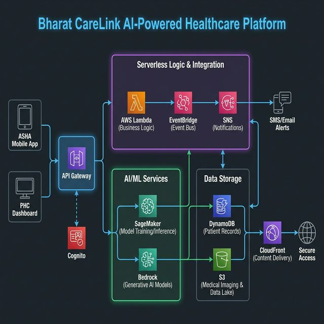

# Bharat CareLink
## AI-Powered Smart Referral & Risk Intelligence Platform
### AWS AI for Bharat Hackathon

## Table of Contents
1. [Problem Statement](#1-problem-statement)
2. [Solution Overview](#2-solution-overview)
3. [Core Objectives](#3-core-objectives)
4. [Key Features](#4-key-features)
5. [System Architecture](#5-system-architecture)
6. [Risk Scoring Model](#6-risk-scoring-model)
7. [Data Model (High-Level)](#7-data-model-high-level)
8. [API Design (Overview)](#8-api-design-overview)
9. [Security & Compliance](#9-security--compliance)
10. [Non-Functional Requirements](#10-non-functional-requirements)
11. [Deployment Strategy](#11-deployment-strategy)
12. [Success Metrics](#12-success-metrics)
13. [Documentation](#13-documentation)
14. [Product Roadmap & Scalability](#14-product-roadmap--scalability)
15. [Market Opportunity & Social Impact](#15-market-opportunity--social-impact)
16. [Target Impact Summary](#16-target-impact-summary)

---

## 1. Problem Statement


In rural India, ASHA (Accredited Social Health Activist) workers identify high-risk patients including:

- Pregnant women with complications  
- Malnourished children  
- Tuberculosis suspects  
- Patients with chronic illnesses  

Referrals from ASHA workers to Primary Health Centres (PHCs) are currently:

- Manual or fragmented (paper-based or informal communication)
- Lacking structured patient data
- Not tracked through completion
- Not prioritized by medical risk
- Duplicated across ASHA and PHC systems
- Invisible to supervisors in real time

This results in:

- Delayed care for high-risk patients  
- Overloaded PHCs without prioritization  
- Missed follow-ups  
- Poor referral closure rates  
- Limited district-level visibility  

---

## 2. Solution Overview

Bharat CareLink is a cloud-native, AI-driven referral intelligence platform that:

- Digitizes referral creation at the ASHA level
- Applies automated risk scoring using machine learning
- Creates prioritized queues at PHCs
- Enables closed-loop referral tracking
- Provides real-time dashboards for supervisors
- Eliminates duplicate data entry
- Supports offline-first mobile workflows

The platform ensures that the highest-risk patients receive timely attention.

---

## 3. Core Objectives

1. Standardize referral data capture  
2. Automate patient risk stratification  
3. Enable PHC-level prioritization  
4. Track referral lifecycle end-to-end  
5. Provide district-level analytics  
6. Ensure secure, scalable, serverless deployment  

---

## 4. Key Features

### 4.1 Structured Referral Creation
- Digital form-based patient intake
- Validation rules on vital inputs
- Auto-generated referral ID
- Geotagging of ASHA location

### 4.2 AI-Based Risk Scoring
- Real-time risk prediction via ML endpoint
- Risk category classification (LOW / MEDIUM / HIGH)
- Priority ranking within PHC queue

### 4.3 PHC Smart Queue
- Sorted by risk score and time
- Filter by condition type
- SLA monitoring for response time

### 4.4 Follow-Up Tracking
- Status updates (REFERRED → VISITED → TREATED → CLOSED)
- Missed visit alerts
- Escalation rules for overdue cases

### 4.5 Supervisor Dashboard
- Referral trends by district
- Risk distribution heatmaps
- Closure rate tracking
- SLA breach reporting

### 4.6 Offline-First Support
- Local caching on mobile device
- Background sync when connectivity is restored
- Conflict resolution based on timestamp

---

## 5. System Architecture



### 5.1 High-Level Flow

ASHA Mobile App  
→ REST API  
→ Serverless Backend  
→ Database  
→ ML Risk Scoring Endpoint  
→ PHC Dashboard  
→ Analytics Dashboard  

### 5.2 AWS Services Used
Bharat CareLink is built 100% on AWS to leverage best-in-class AI and serverless capabilities:

- **Amazon Bedrock (Claude 3.5 Sonnet):** For generating clinical case summaries and patient insights.
- **Amazon SageMaker:** To host custom XGBoost and Random Forest risk scoring models.
- **Amazon Transcribe:** For multi-lingual voice-based data entry (Hindi, regional).
- **AWS Lambda & API Gateway:** Providing a scalable, serverless backend.
- **Amazon DynamoDB:** High-performance NoSQL for patient and referral tracking.
- **Amazon EventBridge:** Event-driven architecture for real-time notifications and escalations.
- **Amazon SNS:** Transactional SMS alerts for ASHA workers and patients.
- **Amazon S3 & CloudFront:** Secure storage and optimized content delivery for the web dashboard.
- **AWS Cognito:** Secure authentication with RBAC.

### 5.3 The AI-First Innovation
Unlike traditional referral systems, Bharat CareLink is "AI-First":
- **Intelligent Triage:** Not just a queue, but a prioritized list based on ML-driven risk scores.
- **Voice-to-Form:** Reducing ASHA worker burnout through multi-lingual voice transcription.
- **Automated Summarization:** Instantly distilling complex patient records into actionable medical summaries for doctors.

(See `design.md` for detailed service mapping and infrastructure design.)


---

## 6. Risk Scoring Model

### 6.1 Input Features

- Age  
- Pregnancy week  
- Hemoglobin level  
- BMI  
- Blood pressure  
- TB symptom indicator  
- Chronic disease indicator  
- History of complications  
- Missed visit count  

### 6.2 Output

```json
{
  "risk_score": 0.00-1.00,
  "risk_category": "LOW | MEDIUM | HIGH",
  "priority_rank": integer
}
```

### 6.3 Risk Thresholds

| Risk Score Range | Risk Category |
|------------------|--------------|
| 0.00 – 0.39      | LOW          |
| 0.40 – 0.69      | MEDIUM       |
| 0.70 – 1.00      | HIGH         |

**Configuration Rules:**
- Threshold values must be configurable via admin settings.
- Threshold updates must not require application redeployment.
- Changes must be versioned and logged for audit purposes.
- Each risk assessment record must store the threshold version applied at scoring time.

---

## 7. Data Model (High-Level)

### 7.1 Core Entities

- Patient
- Referral
- RiskAssessment
- FollowUp
- User (ASHA / PHC / Supervisor / Admin)

Detailed schema definitions are provided in `requirements.md`.

---

## 8. API Design (Overview)

### Referral APIs

- `POST /referrals`
- `GET /referrals/{id}`
- `GET /phc/{id}/queue`
- `PATCH /referrals/{id}/status`

### Risk Scoring API

- `POST /risk/score`

Full API contracts including request/response schemas are defined in `requirements.md`.

---

## 9. Security & Compliance

- Role-Based Access Control (RBAC)
- Encryption at rest for all databases and object storage
- TLS 1.2+ for all API communication
- Audit logging for all referral state transitions
- PII masking in logs
- Least-privilege IAM policies

---

## 10. Non-Functional Requirements

- API latency ≤ 2 seconds (p95)
- System uptime ≥ 99.5%
- Horizontal scalability for district-level deployment
- Offline capability for intermittent connectivity regions
- Full auditability of referral lifecycle
- Idempotent API design for retry-safe operations

---

## 11. Deployment Strategy

- Infrastructure as Code (IaC)
- CI/CD via GitHub Actions
- Multi-environment deployment:
  - dev
  - staging
  - production
- Blue/Green or Canary deployments for backend updates
- Automated ML model retraining pipeline

Detailed deployment architecture is defined in `design.md`.

---

## 12. Success Metrics

- ≥ 30% reduction in referral delays
- ≥ 40% improvement in PHC triage time
- ≥ 80% precision in high-risk ML classification
- 100% referral lifecycle visibility
- Measurable reduction in duplicate patient entries

---

## 13. Documentation

- `requirements.md` → Functional and technical requirements
- `design.md` → Architecture, infrastructure, ML pipeline, and deployment details

---

## 14. Product Roadmap & Scalability

### Phase 1: Pilot (0-6 Months)
- Deployment across 50 PHCs in a single district.
- Fine-tuning risk scoring models on local population data.
- Formal training for 500+ ASHA workers.

### Phase 2: District-Scale (6-18 Months)
- Integration with state-level health registries.
- Adding support for 5 additional regional languages (Marathi, Gujarati, Kannada, etc.).
- Automated inventory planning for high-risk medication based on referral trends.

### Phase 3: National Integration (18+ Months)
- Seamless integration with ABHA (Ayushman Bharat Health Account).
- Federated learning to improve AI models without moving PII across borders.
- Real-time national dashboard for maternal and child health monitoring.

---

## 15. Market Opportunity & Social Impact

Bharat CareLink addresses the "Referral Leakage" problem in India's Rs. 5 Lakh Crore public health system. 
- **Cost Savings:** By triaging patients correctly, PHCs save an estimated 20% in unnecessary transport and administrative overhead.
- **Improved Outcomes:** Early detection of high-risk cases reduces maternal mortality (MMR) and infant mortality (IMR).
- **Sustainability:** A SaaS-based model for private hospitals and a partnership model for state governments ensure long-term viability.

---

## 16. Target Impact Summary
Bharat CareLink enables structured, AI-driven healthcare referrals in rural ecosystems, ensuring:
- **High-risk patients are prioritized** via ML-driven triage.
- **PHCs operate efficiently** with structured data and AI summaries.
- **ASHA workers are empowered** with multi-lingual voice-to-form tools.
- **Health outcomes are data-driven**, reducing systemic delays.
